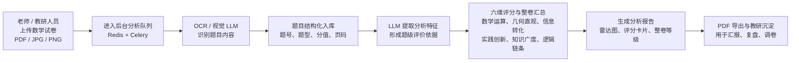

# 数学试卷六维分析系统简要介绍

## 一、项目定位

## 二、基础功能

1. **试卷上传**：支持单个 PDF 上传，也支持多张 JPG/PNG 图片按页序上传；上传时会校验文件格式、大小和图片有效性，降低无效任务进入分析流程的概率。
2. **题目识别与解析**：系统通过 OCR/视觉 LLM 提取试卷内容，识别题目文本、页码、题号、题型、分值等基础信息，并把题目结构化入库。
3. **六维自动分析**：系统对每道题提取分析特征，再按六个维度进行题级评分，最后汇总为整卷维度结果。
4. **报告展示**：前端提供六维雷达图、维度评分卡片、整卷等级、综合分、目标学生等报告内容，便于快速理解试卷定位。
5. **PDF 导出**：分析完成后可导出专业版 PDF 报告，用于教研留档、沟通汇报或后续复盘。

## 三、六维分析点

- **数学运算**：重点看计算负担、运算步骤、数字复杂度、结构变形和巧算要求，判断试卷对学生计算能力的要求。
- **几何直观与空间想象**：重点看图形识别、几何关系、面积/体积模型、辅助线、空间重构等要求，判断几何与空间思维负担。
- **信息提取与转化**：重点看条件数量、信息分布、干扰信息、图文/表格信息、多条件转化和建模表达，判断学生从题干中提取并转化信息的难度。
- **实践创新**：重点看题目在所属知识点内部是基础模板、轻度变式、中度变式、高阶变式还是压轴创新，判断是否需要非常规思路、策略迁移或开放表达。
- **知识广度**：重点看解题所需的最高知识门槛和知识来源层级，例如校内教材、低段拓展、高年级拓展、初中前置或高阶竞赛内容。
- **逻辑链条**：重点看推理跨度、隐藏关系、多阶段状态变化、分支讨论、反向推演和一致性回查，判断题目对逻辑组织能力的要求。

## 四、任务排队机制

试卷上传成功后不会直接阻塞在页面上，而是进入后台分析队列。系统使用 Redis + Celery 派发任务，由 worker 异步执行 OCR 解析、题目入库、LLM 分析、报告生成和快照保存。

排队机制主要解决两个问题：第一，保护 OCR 和 LLM 资源，避免同时涌入过多大文件导致服务不稳定；第二，让用户能看到明确进度。前端会展示“已进入分析队列”“正在排队”“等待 worker 接手”“LLM 正在分析题目”“正在生成报告”等阶段，并在题目分析阶段显示已完成题数。队列满时系统会提示稍后上传，优先保证已入队任务稳定完成。

## 五、当前价值

这个系统当前已经形成了从“上传试卷”到“生成报告”的闭环能力。它的核心价值不只是自动化生成一份报告，而是把试卷难度、能力结构和题目分析依据沉淀为结构化数据，帮助教研团队更快判断试卷适合什么学生、哪些能力要求更突出、后续调卷或讲评应该关注哪里。

对管理层来说，项目的意义在于：把原本依赖个人经验的试卷评价流程标准化、数据化；把单次分析结果沉淀为可追踪资产；并为后续批量分析、班级/学校统计、错题薄弱点分析和教研规则优化打基础。
